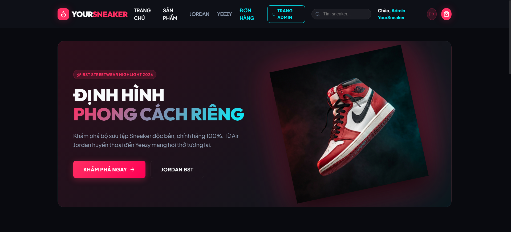
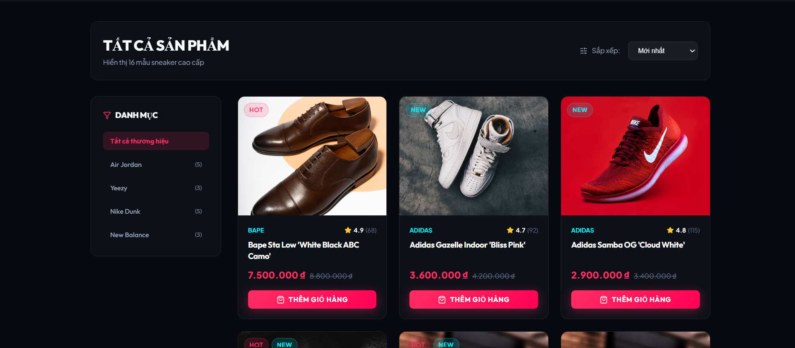
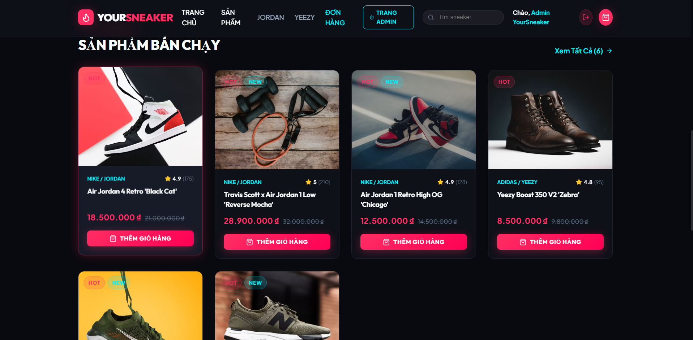
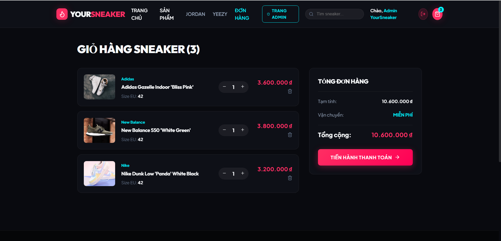
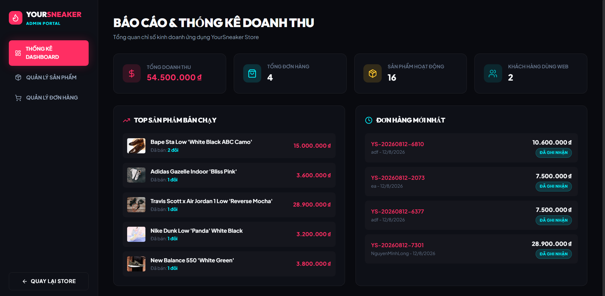

# 👟 YourSneaker — Streetwear & Sneaker E-Commerce Platform

[](https://dotnet.microsoft.com/)
[](https://react.dev/)
[](https://www.typescriptlang.org/)
[](https://www.mysql.com/)
[](https://www.docker.com/)
[](#)
[](#)
[](https://youtu.be/_y9Tr9E2Dgs)

> **YourSneaker** là nền tảng thương mại điện tử chuyên biệt về Sneaker & Streetwear cao cấp. Dự án được thiết kế theo kiến trúc **Clean Architecture (.NET 9 Web API)** kết hợp với giao diện **React + Vite (Dark Streetwear Glassmorphic UI)** mang lại trải nghiệm độc bản, mượt mà và hiện đại.

---

## 🎬 Video Demo & Giao Diện Ứng Dụng

> 🎥 **Xem Video Demo thực tế trên YouTube:** [https://youtu.be/_y9Tr9E2Dgs](https://youtu.be/_y9Tr9E2Dgs)

[](https://youtu.be/_y9Tr9E2Dgs)

### 1. Trang Chủ & Hero Section Nổi Bật (Home Page)


### 2. Danh Sách Sản Phẩm & Bộ Lọc Streetwear (Products Page)


### 3. Chi Tiết Sản Phẩm & Điểm Nhấn Banner (Hot Screen)


### 4. Giỏ Hàng & Thanh Toán Đơn Hàng (Cart & Checkout)


### 5. Trang Quản Trị Hệ Thống (Admin Portal & Dashboard Analytics)


---

## 🌟 Tính Năng Nổi Bật

### 🛒 1. Khách Hàng (Customer Storefront)
- **Giao diện Streetwear độc bản**: Thiết kế Dark Mode kết hợp hiệu ứng Glassmorphism & Neon Cyan/Crimson accents.
- **Hero Showcase 3D**: Trình diễn sản phẩm Air Jordan biểu tượng với hiệu ứng ánh sáng ambient và tương tác di chuột linh hoạt.
- **Bộ lọc & Tìm kiếm sản phẩm**: Lọc đa chiều theo Danh mục, Thương hiệu (Nike, Adidas, Jordan, Yeezy), Khoảng giá và Sắp xếp linh hoạt.
- **Giỏ hàng thông minh (Zustand)**: Quản lý giỏ hàng client-side mượt mà, lưu trữ vị trí size và số lượng tức thì.
- **Thanh toán linh hoạt**:
  - **COD (Cash On Delivery)**: Thanh toán tiền mặt khi nhận hàng.
  - **Cổng thanh toán VNPay Sandbox**: Tích hợp mã hóa **HMAC-SHA512**, hỗ trợ quét mã QR và Thẻ ngân hàng.
- **Quản lý Đơn hàng cá nhân**: Xem lịch sử mua hàng, mã vận đơn, trạng thái thanh toán và cập nhật tiến trình đơn.

### 👑 2. Quản Trị Hệ Thống (Admin Portal)
- **Báo cáo Thống kê (Dashboard Analytics)**:
  - Tổng doanh thu real-time, tổng số đơn hàng, tổng sản phẩm & số lượng khách hàng.
  - Thống kê **Top 5 Sản phẩm bán chạy nhất** và các đơn hàng phát sinh gần nhất.
- **Quản lý Sản phẩm (Product CRUD)**:
  - Thêm, Sửa, Xóa thông tin Sneaker, tồn kho, giá bán & nhãn Nổi bật.
  - **Tải ảnh linh hoạt (Hybrid Upload)**: Hỗ trợ cả **Upload File ảnh từ máy tính** (Lưu tại `wwwroot/uploads`) hoặc dán **URL CDN**.
- **Quản lý Đơn hàng hệ thống**: Cập nhật trạng thái đơn (*Chờ xử lý, Đang đóng gói, Đang giao, Đã giao, Đã hủy*) theo thời gian thực.

---

## 🏗️ Cấu Trúc Kiến Trúc (Clean Architecture)

Dự án áp dụng mô hình **Clean Architecture 4 Tầng** đảm bảo nguyên lý SOLID và khả năng mở rộng:

```text
YourSneaker/
├── captureImage/                         # Thư mục hình ảnh Demo giao diện
├── server/                               # Backend ASP.NET Core 9
│   ├── src/
│   │   ├── YourSneaker.Domain/           # Core Entities, Enums, Value Objects
│   │   ├── YourSneaker.Application/      # DTOs, Interfaces, Service Contracts, Business Logic
│   │   ├── YourSneaker.Infrastructure/   # AppDbContext (EF Core), Service Implementations, VNPay
│   │   └── YourSneaker.Api/              # Controllers, Middleware, Program.cs (DI & Pipeline)
│   └── YourSneaker.sln
│
├── client/                               # Frontend React 18 + Vite + TypeScript
│   ├── src/
│   │   ├── api/                          # Axios API Clients (Auth, Products, Orders, Admin, Payment)
│   │   ├── components/                   # UI Reusable Components (Header, Footer, ProductCard, Layout)
│   │   ├── pages/                        # Home, Products, Detail, Cart, Checkout, Admin Portal
│   │   ├── store/                        # Zustand Global State Management
│   │   ├── styles/                       # CSS Variables, Glassmorphism, Theme Design System
│   │   └── types/                        # TypeScript Interfaces & DTO Types
│   └── index.html
│
└── docker-compose.yml                    # MySQL 8.0 Container Setup
```

---

## 🔑 Tài Khoản Trải Nghiệm (Demo Credentials)

| Vai trò | Email / Username | Mặc định Mật khẩu | Quyền hạn |
| :--- | :--- | :--- | :--- |
| **Admin** | `admin@yoursneaker.com` | `Admin@123` | Toàn quyền Dashboard, CRUD Sản phẩm, Quản lý Đơn hàng |
| **Customer** | `customer@yoursneaker.com` | `Customer@123` | Xem sản phẩm, Đặt hàng, Thanh toán VNPay |

### 💳 Thẻ Test Cổng Thanh Toán VNPay Sandbox
- **Ngân hàng**: NCB
- **Số thẻ**: `9704198526191432198`
- **Tên chủ thẻ**: `NGUYEN VAN A`
- **Ngày phát hành**: `07/15`
- **Mã OTP**: `123456`

---

## 🚀 Hướng Dẫn Chạy Dự Án (Quick Start)

### Yêu cầu môi trường:
- [.NET 9.0 SDK](https://dotnet.microsoft.com/download)
- [Node.js v18+](https://nodejs.org/)
- [Docker Desktop](https://www.docker.com/)

### Các bước khởi chạy:

#### 1. Khởi tạo Cơ sở dữ liệu MySQL với Docker
```bash
docker-compose up -d
```

#### 2. Khởi chạy Backend ASP.NET Core API
```bash
cd server/src/YourSneaker.Api
dotnet run
```
> API Swagger UI tự động kích hoạt tại: `http://localhost:5000/swagger`

#### 3. Khởi chạy Frontend React Client
```bash
cd client
npm install
npm run dev
```
> Ứng dụng Web sẽ mở tại: `http://localhost:5173`

---

## 📄 Tài Liệu Tham Chiếu Dự Án

- 📖 [Dự án Chi tiết các Phase (`project-phases.md`)](./docs/project-phases.md)
- 📐 [Hệ thống Thiết kế UI/UX (`DESIGN.md`)](./DESIGN.md)
- 🔌 [Tài liệu API Specification (`api-spec.md`)](./docs/api-spec.md)
- 🗄️ [Sơ đồ Cấu trúc CSDL (`database-schema.md`)](./docs/database-schema.md)

---

⭐ *Project được xây dựng bởi **KLBMinhLong** phục vụ cho Portfolio phát triển Full-stack Web Application chuyên nghiệp.*
